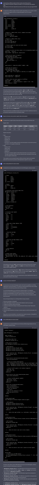

# 这里总结了ChatGPT等AI技术在数字IC中写Verilog，写验证verilog, system verilog testbench，UVM testbench, 规则书文档生成等的应用

1. 用ChatGPT生成APB总线寄存器接口接口Verilog代码，再分别用Verilog和UVM方法学写testbench
2. SoC
3. CPU
4. AI芯片
5. 数模接口芯片
6. 高速接口芯片

